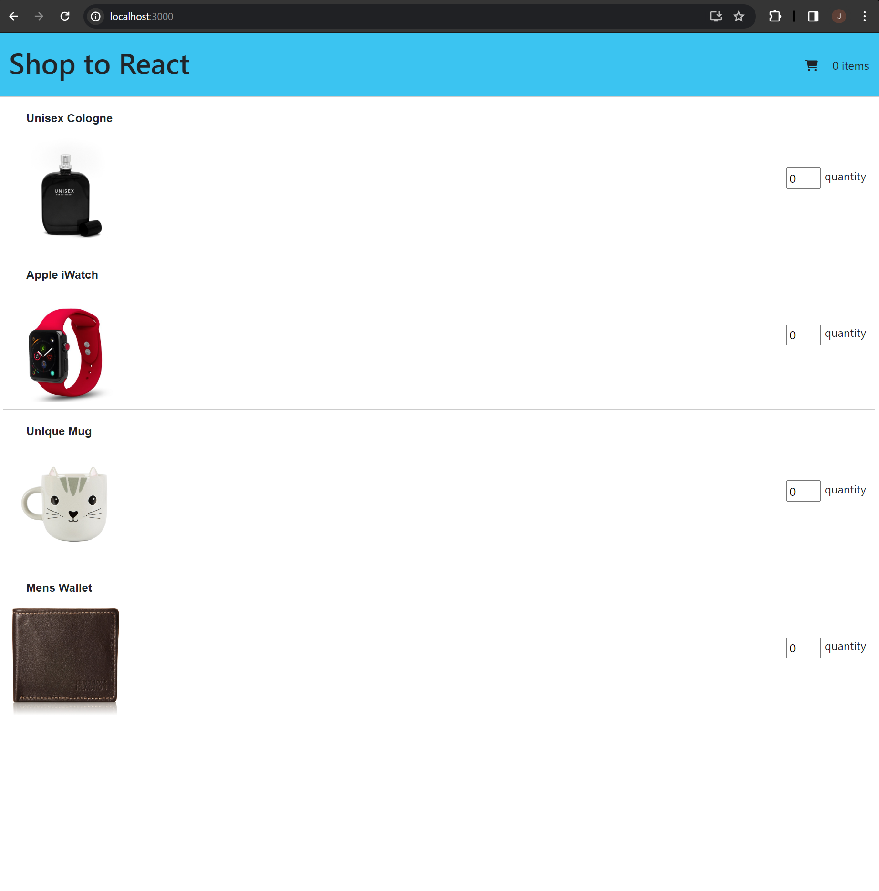
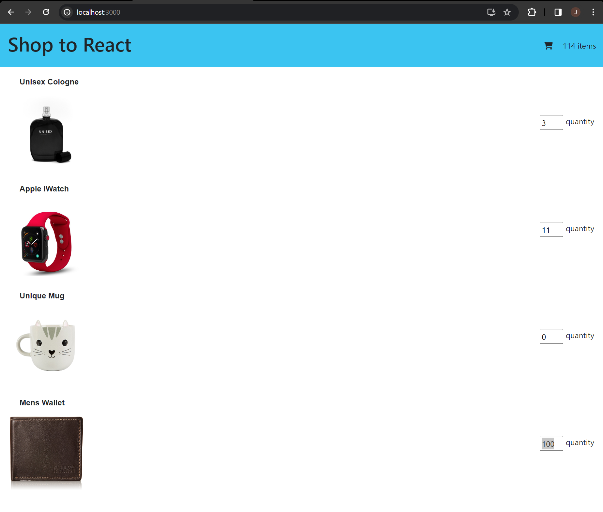

# web603-lab-week1

## Getting Started

Create a basic React app and install dependencies:

```
npx create-react-app shopcart

npm install bootstrap

npm install reactstrap

npm i --save @fortawesome/fontawesome-svg-core
npm install --save @fortawesome/free-solid-svg-icons
npm install --save @fortawesome/react-fontawesome
```

## Output

### Home Page



### Calculate Total Quantity

- Minimum quantity: 0
- Minimum quantity: 100


